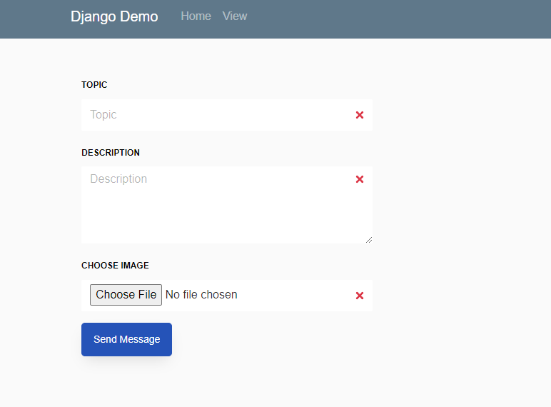
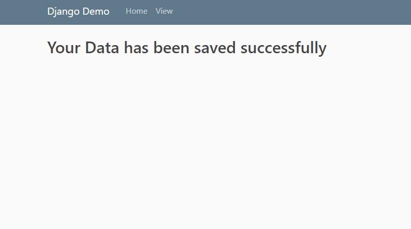
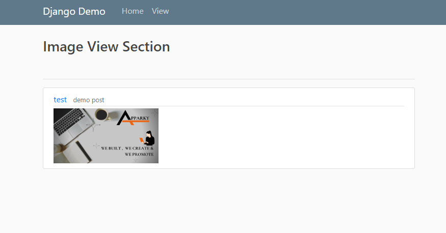

# Django-Image-Viewers-Python-APPARKY

> In this __Django Project__ we have designed a way to upload `Images` to the `Database` and the way to extract from the `Database`.
> 
> We have agreed the terms and conditions of [__Bootstrap__](https://getbootstrap.com/) and have used free [__Bootstrap__](https://getbootstrap.com/) Templates in our work.
> 
> &nbsp; &nbsp; &nbsp; &nbsp; &nbsp; &nbsp; &nbsp; [__Bootstrap__](https://getbootstrap.com/) is a free, open source front-end development framework for the creation of websites and web apps. 
> Designed to enable responsive development of mobile-first websites, Bootstrap provides a collection of syntax for template designs.
> 
> 

## Step 1:

Create a Folder first and open it from `CMD` (Windows) or your native `terminal`

Install [`Django`](https://www.djangoproject.com/) to your system by using this `command`

```commandline
pip install django
pip install Pillow
```

We also attached a `requirement.txt` file with this repo with all credentials. 
Follow this command to Install Libraries fro `requirement.txt`

```commandline
pip install -r requirement.txt
```


If done, create a new project file by typing this

```commandline
django-admin startproject YOURPROJECTNAME .
# In this project is the name of it is images.
```

That's all. All your Native file will be created to yhe folder, and you are ready to start


## Step 2:

Now open the project file with the `IDLE` you like to use

Open the `terminal` from your `IDLE` and type 

```commandline
python manage.py runserver
```

> And you are good to go. Open this link form you browser [http://localhost:8000/](http://localhost:8000/)
> 
> You will see the `server` is running
> 
> 

Now Let's Create an application for it to `Upload` and `View` Images.

For Creating an Application type this to your `terminal`

```commandline
python manage.py startapplications imageviewer
```

You can see now a new folder has been created to your project directory

Now go to `settings.py` file you will find some list of installed application there

```commandline
INSTALLED_APPS = [
    'django.contrib.admin',
    'django.contrib.auth',
    'django.contrib.contenttypes',
    'django.contrib.sessions',
    'django.contrib.messages',
    'django.contrib.staticfiles',    
]
```

add the application name and save the file

```commandline
INSTALLED_APPS = [
    'django.contrib.admin',
    'django.contrib.auth',
    'django.contrib.contenttypes',
    'django.contrib.sessions',
    'django.contrib.messages',
    'django.contrib.staticfiles',
    
    'imageviewer', # app name has to insert here to make it work
]
```

like this


After that go to the application folder and create a new file named `urls.py`. Now you just have to register the application url to the project url like this

```commandline
from django.contrib import admin
from django.urls import path, include

urlpatterns = [
    path('admin/', admin.site.urls),
    path('', include('imageviewer.urls'))
]

```

Go back to project application directory, and open `urls.py`, edit the file accordingly

```commandline
from django.contrib import admin
from django.urls import path
from . import views

urlpatterns = [
    path('', views.index, name='index'),
    path('view/', views.viewer, name='viewer')
]

```

Now come back to Application directory and open `views.py` file

You can copy and paste the `code` from here

```commandline
from django.shortcuts import render
from .models import *
from imageviewer.forms import PostInfo


def index(request):
    if request.method == 'POST':
        post = Post_info()

        topic = request.POST.get('topic')
        description = request.POST.get('description')
        images = request.FILES['image']

        post.topic = topic
        post.description = description
        post.images = images
        post.img_alt = 'Default ALT TAG'

        form = PostInfo(request.POST, request.FILES)
        if form.is_valid():
            post.save()

            return render(request, 'success.html')

    return render(request, 'index.html')


def viewer(request):
    posts = Post_info.objects.all()
    return render(request, 'view.html', {'posts': posts})


```

Now the `server` is ready to go.

## Step 3:

Previously we are done creating the `server`. Here we will add some `HTML` file with it

Again, You can also find it from [Bootstrap](https://getbootstrap.com/)

> Now create a folder named `static` and `templates`
> 
> Again go to `settings.py` file and follow this step
> 
> Find `TEMPLATES` section and alter this with the given billow lines

```commandline
TEMPLATES = [
    {
        'BACKEND': 'django.template.backends.django.DjangoTemplates',
        'DIRS': ["templates"],
        'APP_DIRS': True,
        'OPTIONS': {
            'context_processors': [
                'django.template.context_processors.debug',
                'django.template.context_processors.request',
                'django.contrib.auth.context_processors.auth',
                'django.contrib.messages.context_processors.messages',
            ],
        },
    },
]
``` 

> You will also find `STATIC` section, alter it accordingly with the given lines

```commandline
STATIC_URL = '/static/'

MIDEA_URL = '/midea/'
MIDEA_ROOT = os.path.join(BASE_DIR, 'midea')

STATICFILES_DIRS = [
    os.path.join(BASE_DIR, 'static')
]

```

In your project Directory, all `html` file will be stored in it, and other `css`, `js` and other fill will be at `static` folder.

In the next step we will discuss how to set up all `.css`, `.js` and other file with `.html` file


## Step 4:

Previously we discuss setting up the `application` and the `HTML`, here w will discuss the `jinga` technique to set up `.css`, `.js` and other files with `.html`


Replace all `.css`, `.js` and other file location like this command billow

```commandline
""
```

```commandline
""
```

Before replacing that make sure in the `static` folder you have created the necessary sub folder 

In this case `css` and `js` are the sub folders

Now run the `server` and you'll see the Site will appear at [http://localhost:8000/](http://localhost:8000/), try the system.

Before running the `server` you need to migrate the project so that the database and of its credentials are ready to store the Feedback info.
To migrate copy the following command to your `terminal`.
```commndline
python manage.py makemigrations
```
```commandline
python manage.py migrate
```

We are all done. The `server` is ready to fire.

## Step 5:

On the `application` Directory open `models.py` and edit it accordingly

```commandline
from django.db import models


# Create your models here.
class Post_info(models.Model):
    topic = models.CharField(max_length=300)
    description = models.TextField()
    images = models.FileField(upload_to='midea/images', blank=True)
    img_alt = models.CharField(max_length=100, null=True, blank=True, default='image_alt')

    def __str__(self):
        return self.topic


```

After that open `admin.py` and edit it accordingly

```commandline
from django.contrib import admin
from .models import *

admin.site.register(Post_info)

```

By this your `database` is ready to store all `Images` Information.

[__Django__](https://www.djangoproject.com/) use [sqlite3](https://sqlite.org/index.html) as a default `database`. To know more about [sqlite3](https://sqlite.org/index.html) Click [Here](https://sqlite.org/index.html)


## Step 6:

Now create `forms.py` file and edit it accordingly

```commandline
from django import forms
from .models import *


class PostInfo(forms.ModelForm):
    class Meta:
        model = Post_info
        fields = ['topic', 'description', 'images', 'img_alt']

```

This file make a connection between your `frontend` with your `backend`.

Your server is all set, It's time to set your `html` file to upload your images into your database.

## Step 7:

Open your `html` file and go to the form section [If There is no form section, add all entry field and buttons in between the form tag].

Copy and paste the given code to your from section
```commandline
enctype = "multipart/form-data"

```

and after that copy and paste the given code
```commandline

{{ form.as_p }}

```


You are all set. Now your server is ready to store and display `Images`

> After running the server This is how it's looks like this
>
> 
>
> After Submitting the information, the web page will look like this
> 
>
> 
>
> Now Click on the __View__, and images will look like this
> 
> 


### To know more about [Django](https://www.djangoproject.com/) Click [Here](https://www.djangoproject.com/)


-------------------
> 
> To get more interesting projects follow our GitHub page at [Here](https://github.com/Apparky)
> 
> To get more interesting projects follow our Bitbucket page at [Here](https://bitbucket.org/apparky-web/workspace/overview)
> 
> To know more about [__APPARKY__](https://apparky.vercel.app/) Click [Here](https://apparky-soumenmtec-gmailcom.vercel.app/)


