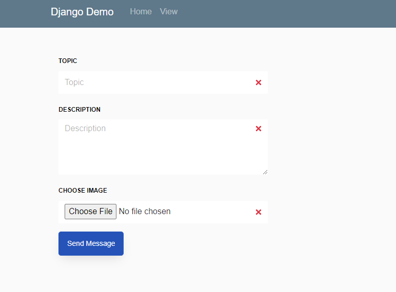
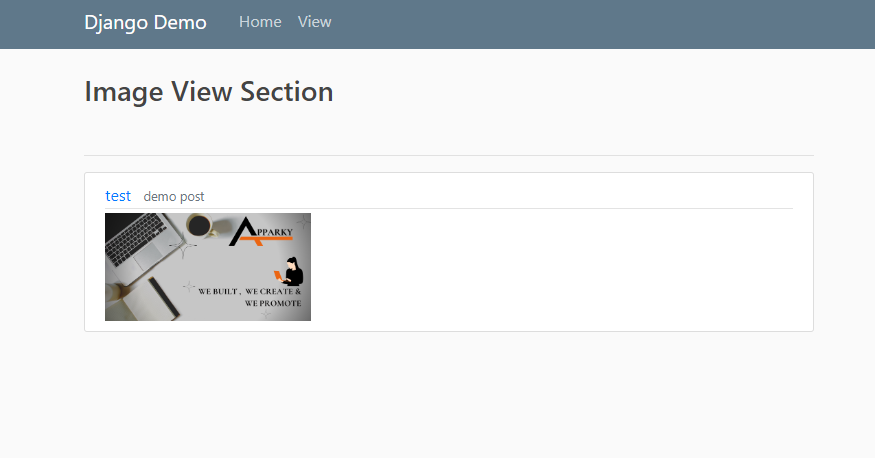

## Step 7:

Open your `html` file and go to the form section [If There is no form section, add all entry field and buttons in between the form tag].

Copy and paste the given code to your from section
```commandline
enctype = "multipart/form-data"

```

and after that copy and paste the given code
```commandline

{{ form.as_p }}

```


You are all set. Now your server is ready to store and display `Images`

> After running the server This is how it's looks like this
>
> 
>
> After Submitting the information, the web page will look like this
> 
>
> 
>
> Now Click on the __View__, and images will look like this
> 
> 

